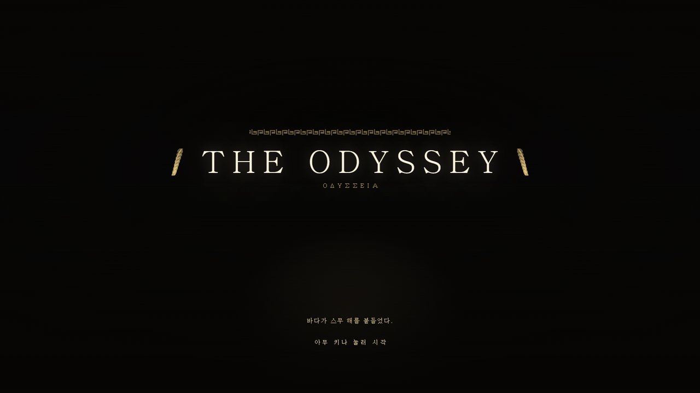
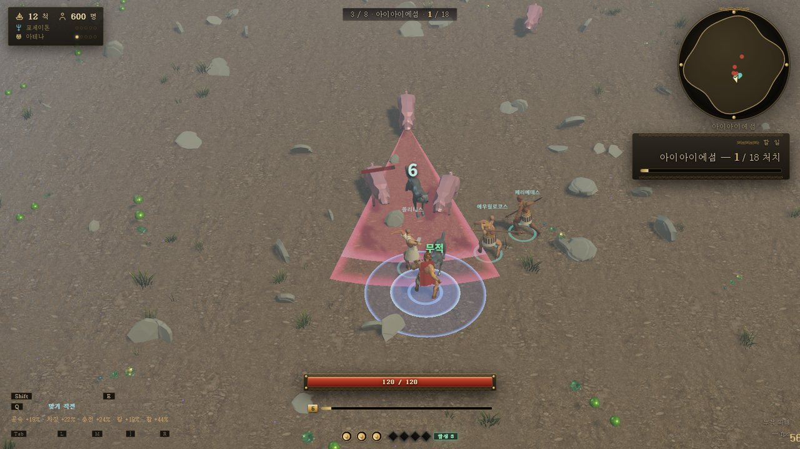
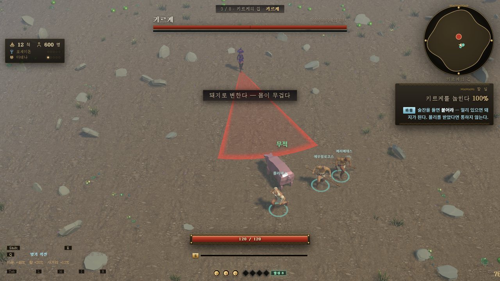
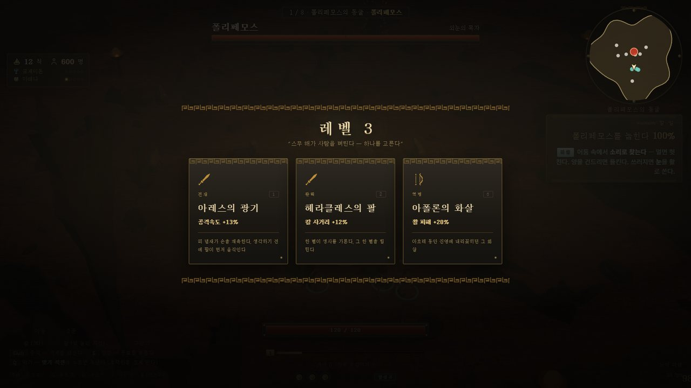
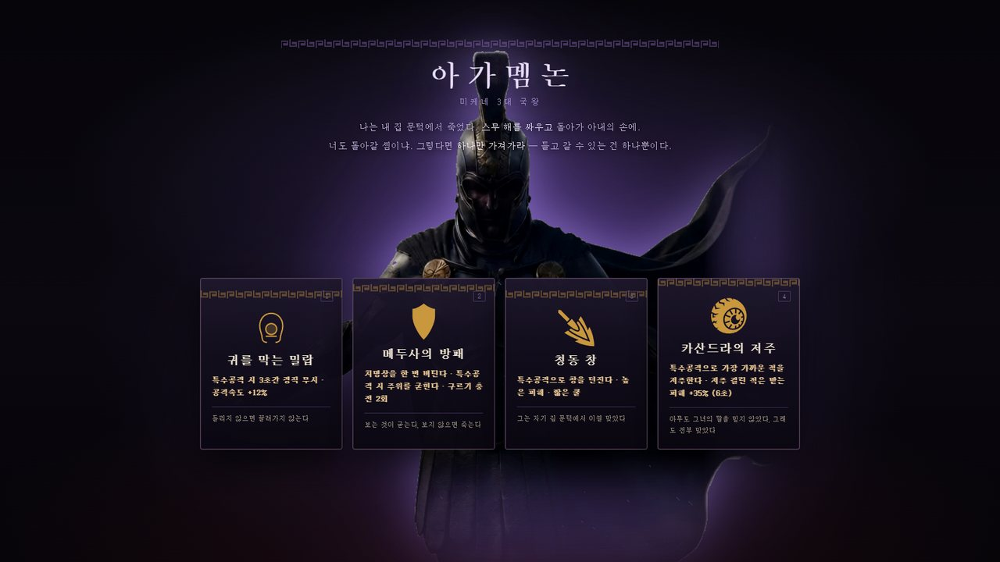
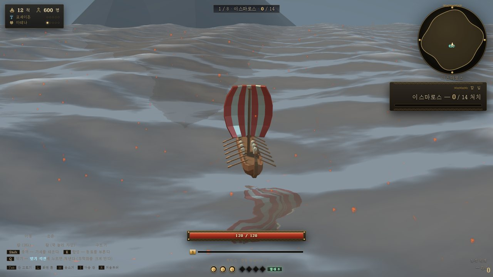

<p align="center">
  
</p>

<h1 align="center">오디세이</h1>

<p align="center">
  오디세우스의 귀향을 따라가는 <b>3D 쿼터뷰 액션 로그라이크</b><br/>
  트로이에서 이타카까지, 여덟 판의 바다를 건너 집으로 돌아간다.
</p>

<p align="center">
  
  
  
  
</p>

---

## 전투

<p align="center">
  
</p>

한 판은 두 구간이다. **웨이브에서 자라고, 그 끝에서 보스를 만난다.**
적은 공격하기 전에 바닥에 붉은 장판을 깔고 위치와 방향을 잠근다. 빨간 데 서 있으면 맞고, 피하면 안 맞는다.
예고를 읽고, 구르고, 반격하는 소울라이크의 리듬을 쿼터뷰로 옮겼다.

<p align="center">
  
</p>

보스는 여덟, 패턴은 50여 개다. 키르케는 돼지를 부르고, 파이어볼을 던지고, 끝내 **플레이어를 돼지로 바꾼다.**

## 성장

<p align="center">
  
</p>

레벨이 오르면 시간이 멈추고 세 장 중 하나를 고른다. 선택지는 **칼 · 활 · 발** 세 계열이다.
한 계열을 계속 파면 등급이 열리고, 어느 순간 수치가 아니라 **플레이 방식**이 바뀐다.

| 등급 | 조건 | 바뀌는 것 |
|---|---|---|
| 일반 | — | 수치가 오른다 |
| 레어 | 같은 계열 2번 | 칼에 불이 붙는다 / 화살이 튕긴다 / 구르기가 적을 벤다 |
| 유니크 | 같은 계열 4번 | 불이 옮아붙는다 / 튕길수록 세진다 / 착지에 충격파 |
| 레전더리 | 같은 계열 6번 | 3타가 불길이 된다 / 화살이 갈라진다 / 잔상이 한 번 더 지나간다 |

## 저승

<p align="center">
  
</p>

네 번째 판에는 싸움이 없다. 구덩이에서 아가멤논의 손이 올라오고, **들고 갈 수 있는 유물은 하나뿐이다.**
밀랍, 메두사의 방패, 청동 창, 카산드라의 저주 중 무엇을 고르느냐로 남은 여정이 달라진다.

## 항해

<p align="center">
  
</p>

판과 판 사이에는 배를 직접 몬다. 막간 그림이 물처럼 녹아 바다가 되고, 거기서부터 돛과 키를 잡는다.
포세이돈의 노여움이 쌓이면 폭풍이 된다. 배 열두 척, 동료 육백 명은 여정 내내 줄어든다.

## 여덟 개의 판

| | 판 | 보스 |
|---|---|---|
| 1 | 이스마로스 | **폴리페모스** — 절반에서 눈이 멀고 아무 데나 던진다 |
| 2 | 텔레필로스 | **안티파테스** — 부하를 부르다 혼자 창과 활을 든다 |
| 3 | 아이아이에섬 | **키르케** — 돼지 소환 · 파이어볼 · 변신 마법 |
| 4 | 저승 | 아가멤논의 **유물 고르기** · 망자에 쫓겨 되돌아 나온다 |
| 5 | 세이렌의 바다 | **세이렌** — 내 발밑에서 솟고, 닿으면 흡수한다 |
| 6 | 메시나 해협 | **갈림길** — 스킬라 또는 카리브디스 |
| 7 | 이타카 | **안티노오스** — 구혼자들의 우두머리 |
| 8 | 죽음 | **텔레고노스** — 이길 수 없다. 입힌 피해가 기록이 된다 |

## 조작

| 키 | 동작 |
|---|---|
| `W` `A` `S` `D` | 이동 |
| 마우스 | 조준 |
| 좌클릭 | 칼 3타 콤보 |
| 우클릭 | 활 (꾹 눌러 차징, 꽉 채우면 관통) |
| `Space` | 구르기 |
| `Shift` | 중격 — 쌓인 기세를 전부 태운다 |
| `E` | 함성 — 동료를 한꺼번에 몰아붙인다 |
| `Q` | 막기 — 맞기 직전에 누르면 쳐낸다 |

## 실행

```bash
npm install
npm run dev      # http://localhost:5180
```

`Tab` 을 누르면 판 목록이 열려서 원하는 판부터 해 볼 수 있다. 주소에 `?stage=4` 를 붙여도 된다.

## 더 보기

- [개발 노트](docs/DEVNOTES.md) — 전투 규칙(프레임 데이터·무적 구간·입력 버퍼), 에셋 최적화, 투사체, 코드 구조, 배포
- [인계 문서](HANDOFF.md) — 지금 어디까지 됐는지
- [크레딧](CREDITS.md) — 캐릭터는 [Quaternius](https://quaternius.com) 의 CC0 팩
